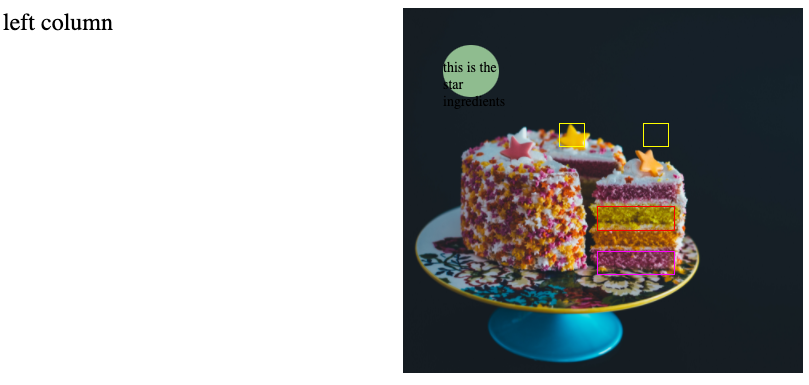

# Video tutorial:
Twenty minute instructional [video](https://www.awesomescreenshot.com/video/3706501?key=8c9c10b82e630e53ed27ac045fdea7cb) 

# Tech
jquery
CSS
HTML

# Description
This code demo shows how to create responsive modals that pop up when you hover over certain areas of an image. It uses jquery and absolute positioning, taking advantage of percentage values for sizes and placement.

# Image Credit
Cake image from Annie Spratt on [Unsplash](https://unsplash.com/photos/6SHd7Q-l1UQ)